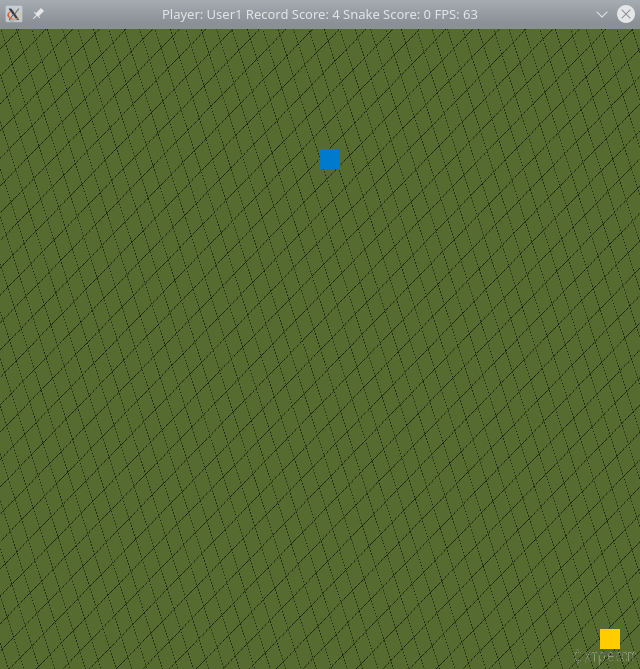

# CPPND: Capstone Snake Game Example

This is the Capstone project in the [Udacity C++ Nanodegree Program](https://www.udacity.com/course/c-plus-plus-nanodegree--nd213). The code for this repo was inspired by [this](https://codereview.stackexchange.com/questions/212296/snake-game-in-c-with-sdl) excellent StackOverflow post and set of responses.

The Capstone Project gives me a chance to integrate what I have learned throughout this program. In this project, I extend this Snake game, following the principles I have learned throughout this Nanodegree Program. This project demonstrates that I can independently create applications using a wide range of C++ features.

## Dependencies for Running Locally
* cmake >= 3.7
  * All OSes: [click here for installation instructions](https://cmake.org/install/)
* make >= 4.1 (Linux, Mac), 3.81 (Windows)
  * Linux: make is installed by default on most Linux distros
  * Mac: [install Xcode command line tools to get make](https://developer.apple.com/xcode/features/)
  * Windows: [Click here for installation instructions](http://gnuwin32.sourceforge.net/packages/make.htm)
* SDL2 >= 2.0
  * All installation instructions can be found [here](https://wiki.libsdl.org/Installation)
  * Note that for Linux, an `apt` or `apt-get` installation is preferred to building from source.
  * For Ubuntu, use the command `sudo apt-get install libsdl2-2.0`.
* gcc/g++ >= 5.4
  * Linux: gcc / g++ is installed by default on most Linux distros
  * Mac: same deal as make - [install Xcode command line tools](https://developer.apple.com/xcode/features/)
  * Windows: recommend using [MinGW](http://www.mingw.org/)

## Basic Build Instructions

1. Clone this repo.
2. Make a build directory in the top level directory: `mkdir build && cd build`
3. Compile: `cmake .. && make`
4. Run it: `./SnakeGame username`. . The program should be started with a parameter `username`, which represent name of the Player.

## Game Extension

1. There is a support for logging high scores.
2. Scores are logged against player name.
3. User can select the background image that is put in `data/background.jpg`

## Code structure

The code is organized in following modules:

| class name | Purpose  |
|------------|----------|
| Controller | Interact with users, let users use keyboard to control the snake in the game. |
| Game       | Game class stores the state in the game, running in loops til end. |
| User       | Basic information about the user and storing the the score. |
| Render     | render the game to the screen. |
| Snake      | contains attributes to keep track of the Snake speed, size, and location. |

## Rubric Points

#### 1.Understaing of C++ and OOP
The project is organized into classes with class and spicifier attributes to hold the data and different techniques of Object Oriented Programming.

#### 2.User inputs
The code accepts input from the user,like adding player name.

#### 3.Read/Write data from/to files
The prject successfully writes the high score and user's score into a file.

#### 4.Reference usage
The project code reference to define variable, as well as passing parameter to function by reference.

#### 5.Access Specifier
All class members are orgnized explicitly between public, protected and private, including the new added class user.

#### 6.Classes abstract implementation details from their interfaces
All class member functions describe their functionality, either through function names or comments.

#### 7.Loops, Functions, I/O
A variety of control structures are used in the project.

#### 8.Memory Management
At least two variables are defined as references, or two functions use pass-by-reference in the project code.

